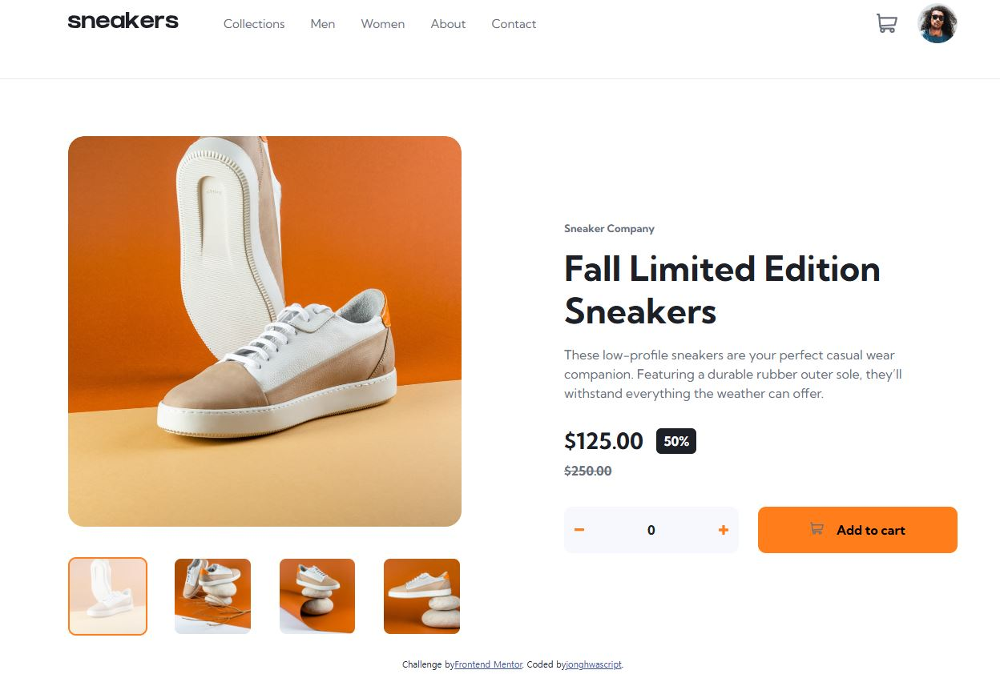

# Frontend Mentor — E-commerce Product Page

This repository contains a responsive product page built for the [Frontend Mentor E-commerce Product Page challenge](https://www.frontendmentor.io/challenges/ecommerce-product-page-UPsZ9MJp6).

## Contents

- [Overview](#overview)
- [Built with](#built-with)
- [Features](#features)
- [Screenshot](#screenshot)
- [Implementation notes](#implementation-notes)
  - [HTML structure and accessibility](#html-structure-and-accessibility)
  - [Responsive layout and spacing](#responsive-layout-and-spacing)
  - [Gallery sizing and Slick](#gallery-sizing-and-slick)
  - [Gallery and lightbox state](#gallery-and-lightbox-state)
  - [Navigation behavior](#navigation-behavior)
  - [Quantity and cart behavior](#quantity-and-cart-behavior)
- [Run locally](#run-locally)
- [Author](#author)
- [AI collaboration](#ai-collaboration)
- [Acknowledgments](#acknowledgments)

## Overview

The page presents a limited-edition sneaker with product imagery, pricing, quantity controls, and a cart. The layout adapts from a full-bleed image carousel on small screens to a two-column product layout with thumbnails and a desktop navigation bar at larger widths.

### Challenge goals

- Adapt the layout to different screen sizes.
- Browse product images with the carousel and thumbnails.
- Open the larger image gallery on desktop.
- Change the quantity and add the product to the cart.
- Review the cart and remove its item.

The page uses sample product data and a client-side cart. Checkout and the header links are presentation placeholders; there is no payment flow or account service.

### Screenshot



### Links

- [Frontend Mentor challenge](https://www.frontendmentor.io/challenges/ecommerce-product-page-UPsZ9MJp6)
- A live deployment has not been published.

## Built with

- Semantic HTML5
- Sass and CSS custom properties
- Flexbox and CSS Grid utilities
- JavaScript and jQuery
- [Slick](https://kenwheeler.github.io/slick/) for the product carousel
- The Kumbh Sans variable font

## Features

- A responsive header with a mobile navigation drawer and a horizontal desktop navigation menu.
- A product gallery with previous and next controls, synchronized thumbnails, and a screen-reader status message.
- A native modal lightbox with thumbnail, arrow, and keyboard navigation on screens at least 1024px wide.
- A quantity selector that prevents values below zero and reports an attempt to add zero items.
- A cart panel with a quantity badge, item total, removal control, and empty state.
- Keyboard focus styles, focus restoration, skip navigation, and reduced-motion handling for the navigation drawer.

## Implementation notes

### HTML structure and accessibility

- The document uses a skip link, `header`, `nav`, `main`, product `article`, gallery `section`, native `dialog`, and `footer` landmarks.
- The main product title is the page's `h1`. The cart and lightbox use labelled headings.
- Decorative SVGs are hidden from assistive technology. Product images have descriptive alternative text; thumbnail images are decorative because their buttons have their own accessible names.
- On mobile, gallery images are non-interactive elements. At the desktop breakpoint, JavaScript changes them to buttons and adds the lightbox relationship and accessible action label. If the viewport crosses back below the breakpoint while the dialog is open, it closes and focus moves to gallery navigation.
- Buttons share a visible `:focus-visible` outline. The focus outline for the main gallery image is inset so Slick's clipping does not cut it off.
- The navigation drawer keeps its `aria-expanded`, `aria-hidden`, and `inert` states in sync. It traps Tab while open on mobile, restores focus when closed, and becomes an ordinary accessible navigation bar on desktop.

### Responsive layout and spacing

- `.l-center` owns the page's maximum content width and horizontal gutters. `--page-max` is `69.375rem` (1110px); the header and product share that measure.
- The default inline gutter is `--s1` (24px). At the 768px tablet breakpoint, `--gutter-inline` becomes 80px. Avoid adding another outer gutter: it would be added to the `.l-center` padding.
- `.l-switcher` changes the product columns based on its own available width, not the viewport. Its threshold is `64rem` minus the current left and right gutters, keeping the column change aligned with the 1024px desktop breakpoint.
- The gallery uses negative inline margins below 1024px to extend to the viewport edges while the product details remain inside the page gutters.
- Reset styles cap headings and paragraphs at `60ch`. The product details locally remove that cap so their content follows the product column width.
- `.l-stack` owns vertical gaps through `gap` and `--space`; individual children should not add margins to recreate the same spacing.

### Gallery sizing and Slick

Slick sets each slide's width from the gallery viewport. The gallery is a flex item, so `min-inline-size: 0` allows it to shrink instead of expanding to the width of Slick's track. The carousel uses one slide at a time and does not enable `variableWidth`.

Each image sits in an `.l-frame`. The frame's `--n` and `--d` values set its aspect ratio, and the image fills it with `object-fit: cover`. The frame clips the parts of the source image that do not fit that ratio. HTML image dimensions reserve space while images load; CSS controls their rendered size.

Previous and next arrow buttons are existing HTML elements positioned relative to `.c-gallery__stage`. On resize, JavaScript asks Slick to recalculate its slide positions so the next image does not peek into view.

### Gallery and lightbox state

- Clicking a gallery thumbnail moves Slick to its `data-index`. Slick's `beforeChange` event updates the active thumbnail and the “Image n of 4” status, so arrow navigation and thumbnail navigation use the same update path.
- Infinite mode creates cloned slides. Slick marks the slide ancestor with `.slick-cloned`, so the lightbox image list filters out images whose ancestor has that class. This keeps image indices, thumbnails, and status text aligned to the four source images.
- The lightbox is a native modal opened with `showModal()`. Escape closes it; the previous and next buttons and Left/Right keys cycle through images. Closing restores focus to the opener on desktop.
- The lightbox is available at 1024px and above. Below that width, the main gallery remains a carousel rather than advertising an inactive “open dialog” action.

### Navigation behavior

- The mobile menu is fixed off-canvas until opened. While open, the page content is inert, body scrolling is locked, and focus stays in the menu.
- At 1024px, the same navigation list becomes a horizontal header menu. JavaScript removes the mobile-only hidden state and clears any open-menu scroll lock when the viewport crosses the breakpoint.
- The menu uses `100vh` as a fallback and `100dvh` for dynamic viewport height. Its own vertical scrolling keeps all links reachable on short screens. The body remains locked while that internal menu scrolls.
- The drawer transition is disabled when `prefers-reduced-motion: reduce` is active.

### Quantity and cart behavior

- The quantity starts at zero. Decrease is exposed as `aria-disabled` at zero and cannot reduce the value below zero.
- Submitting at zero announces an error. Adding a positive quantity updates the cart and resets the selector to zero.
- The badge shows the sum of item quantities. Cart content is rendered from JavaScript state; the empty message and checkout control are shown according to whether the list contains an item.
- The cart panel's `hidden` property and the toggle's `aria-expanded` value are updated together. It closes from the toggle, Escape, Checkout, or a click outside the panel.
- Removing an item moves focus to the next removal button, or to the cart toggle when the list becomes empty.

## Run locally

Install the dependencies and start the development server:

```bash
npm ci
npm run dev
```

The server is available at `http://localhost:3000`. Stop the development server before creating a one-time production build:

```bash
npm run build
```

The build output is written to `dist/`; edit the source files under `src/` instead.

## Author

- Frontend Mentor: [@jonghwascript](https://www.frontendmentor.io/profile/jonghwascript)

## AI collaboration

Codex was used to review responsive and keyboard interactions, investigate implementation issues, and help draft this project documentation. Browser observations and code changes were checked against the project files.

## Acknowledgments

Thanks to [Frontend Mentor](https://www.frontendmentor.io/) for the challenge and its product page design.
